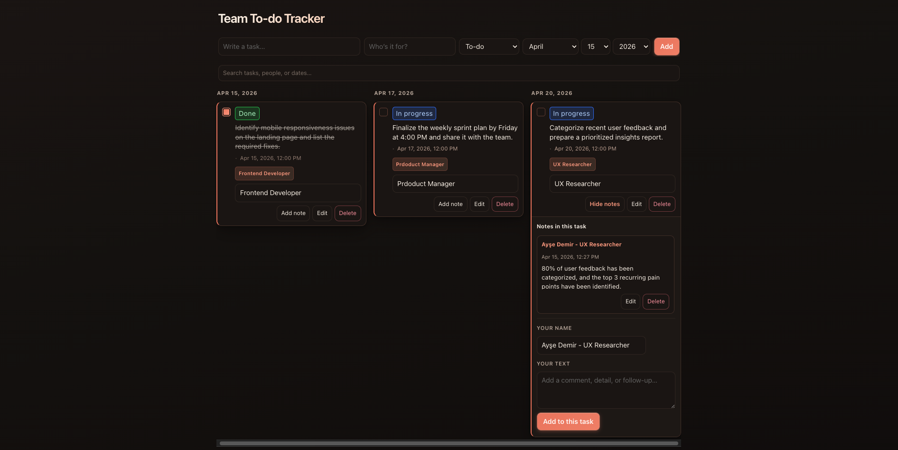
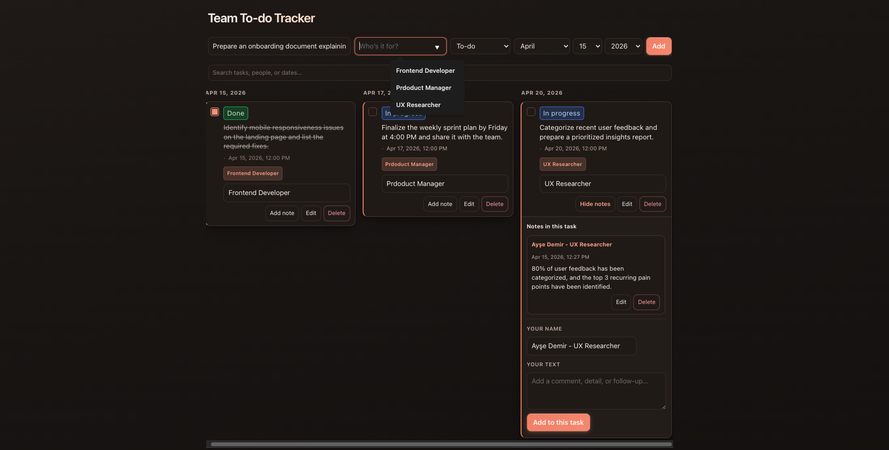
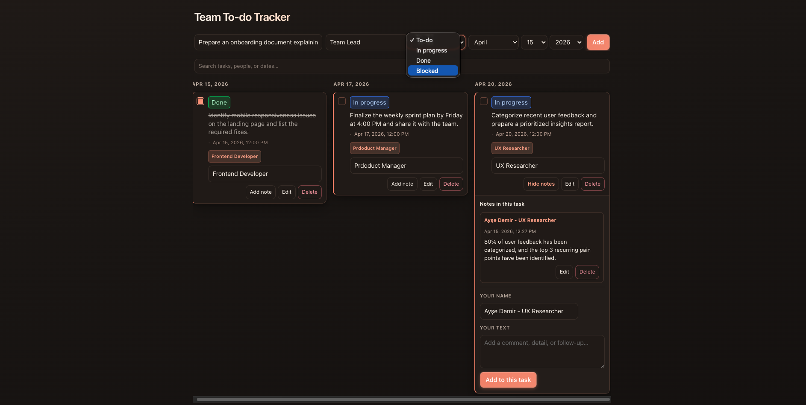
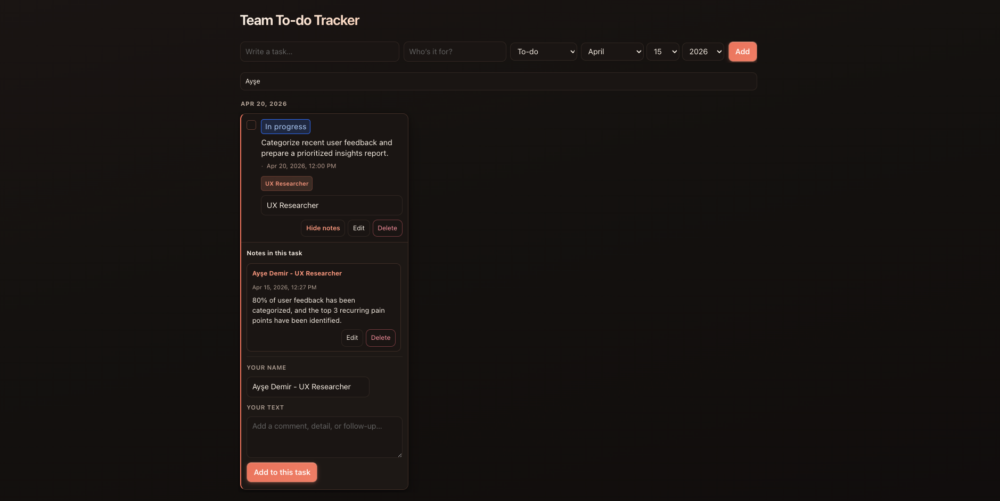

# Team To-do Tracker

A single-page browser app for team tasks organized by assignee. Data is stored in **localStorage**; no backend is required.

Live Demo: [https://teamtodotracker.netlify.app/](https://teamtodotracker.netlify.app/)

## Stack

- **React** 19  
- **Vite** 8  
- **ESLint**

## Setup and run

```bash
npm install
npm run dev
```

The dev server is usually available at [http://localhost:5173](http://localhost:5173).

### Other commands

| Command | Description |
|---------|-------------|
| `npm run build` | Production build to `dist/` |
| `npm run preview` | Preview the production build locally |
| `npm run lint` | Run ESLint |

## Features

- **New task:** title, assignee, status (To-do / In progress / Done / Blocked), and a **planned date** (English month / day / year pickers).
- **Task board:** tasks grouped into **day columns** by planned date (horizontal scroll); column headings use `en-US` medium date style.
- **Status:** change by clicking the badge (no duplicate dropdown next to it).
- **Notes:** multiple comments per task with edit history (**Previous versions**). Comments are ordered **newest first**.
- **Search:** filter by task text, assignee, notes, and **dates** (several common formats and month names).
- **Persistence:** `localStorage` key `todo-assignee-crud` (JSON array).

## Screenshots

Add your screenshots to `assets/screenshots/` and update filenames if needed.

### 1) Dashboard


### 2) Add Task Modal


### 3) Task Detail


### 4) Team View


## Project layout

```
task-bridge/
├── index.html
├── package.json
├── vite.config.js
├── assets/
│   └── screenshots/ # README images
├── src/
│   ├── App.jsx      # Main app logic and UI
│   ├── App.css
│   ├── main.jsx
│   └── index.css
└── public/
```

## License

`package.json` sets `private: true`. Adjust packaging and licensing as needed for your use case.
